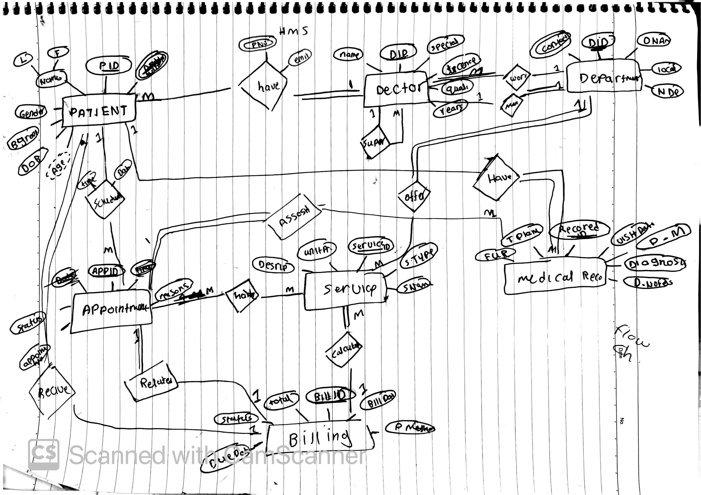

# Hospital Management System ERD

This project represents the Entity Relationship Diagram (ERD) for a Hospital Management System database.

## Entities

- Patient
- Doctor
- Department
- Appointment
- Service
- Medical Record
- Billing

## Relationships

- Patients schedule appointments with doctors
- Doctors work in departments
- Departments offer services
- Appointments include multiple services
- Doctors create medical records
- Billing is generated for appointments

## Database Concepts

- One-to-Many Relationships
- Many-to-Many Relationships
- Derived Attributes
- Composite Relationships

## ERD Diagram

